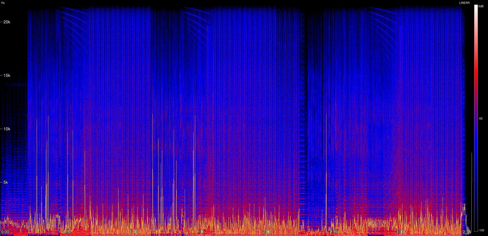
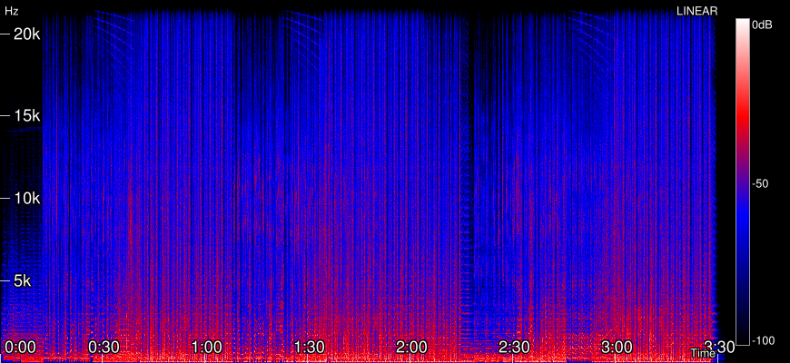
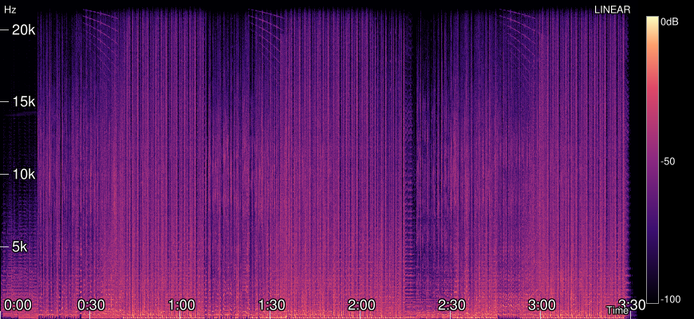
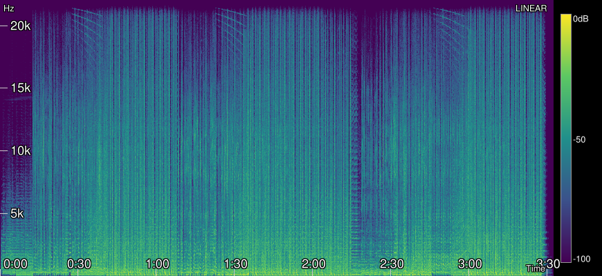
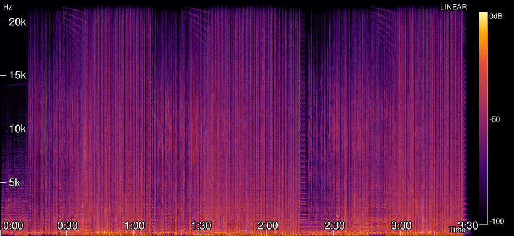
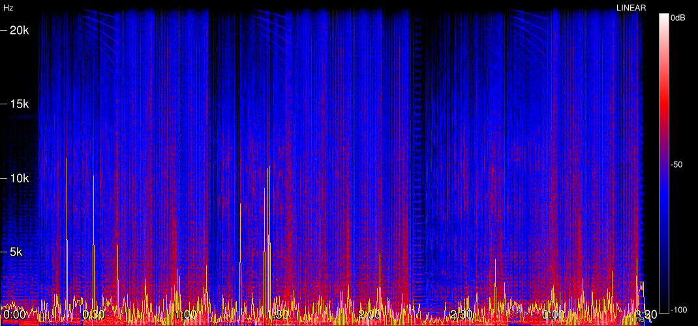

# spek-cli

A terminal-based acoustic spectrum analyzer (spectrogram) viewer, written in Rust. Designed for checking audio quality (identifying "fake" lossless files) directly from your terminal with a beautiful, professional UI.



## Features

*   **High-Resolution Spectrograms**: Uses proper STFT processing (parallelized with `rayon`) to visualize audio frequencies.
*   **Professional Visuals**: 
    *   **Nerd Icons** integrated UI.
    *   **Axis Labels** for frequency and time.
    *   **Color Bar Legend** showing dB scale.
    *   **Scale Indicator** (Linear/Log).
*   **Spectral Rolloff Indicator**: Use `--rolloff` to draw a line at the 85% energy threshold—perfect for spotting MP3s transcoded to FLAC (look for a cutoff around 16kHz).
*   **Multiple Color Palettes**: `audacity`, `magma`, `viridis`, `inferno`, `grayscale`.
*   **Terminal Graphics**: Supports high-quality image rendering via `viuer`.
*   **Configurable**: Auto-generating `config.toml`, CLI flags override defaults.
*   **Broad Format Support**: powered by `symphonia` (FLAC, MP3, WAV, ALAC, AAC, Vorbis, etc.).
*   **Export**: Save spectrograms to high-res PNG files.

## Color Palettes

Choose from 5 built-in color schemes to match your preference or use case:

<table>
  <tr>
    <td align="center">
      <b>Audacity</b> (Default)<br>
      <br>
      <i>Classic blue-red-white gradient</i>
    </td>
    <td align="center">
      <b>Magma</b><br>
      <br>
      <i>Dark purple to bright yellow</i>
    </td>
  </tr>
  <tr>
    <td align="center">
      <b>Viridis</b><br>
      <br>
      <i>Purple to green to yellow</i>
    </td>
    <td align="center">
      <b>Inferno</b><br>
      <br>
      <i>Black to red to bright yellow</i>
    </td>
  </tr>
  <tr>
    <td align="center" colspan="2">
      <b>Grayscale</b><br>
      <br>
      <i>Simple black and white</i>
    </td>
  </tr>
</table>

Use `-p` or `--palette` flag to select: `spek-cli audio.flac -p magma`


## Installation

### Arch Linux

1.  **Install Rust**:
    ```bash
    sudo pacman -S rust
    ```

2.  **Clone and Build**:
    ```bash
    git clone https://github.com/SwagRGB/spek-cli
    cd spek-cli
    cargo build --release
    ```

3.  **Install (Optional)**:
    ```bash
    sudo cp target/release/spek-cli /usr/local/bin/spek
    ```

### Other Distributions

Ensure you have `cargo` installed (usually via `rustup`), then build from source as shown above.

## Usage

Basic usage (defaults to linear scale):
```bash
spek-cli path/to/audio.flac
```

### Options

| Flag | Description |
|------|-------------|
| `-w, --width <PX>` | Width of the output image in pixels (default: 2048) |
| `-H, --height <PX>` | Height of the output image in pixels (default: 1024) |
| `--log` | Use **logarithmic** frequency scale (recommended for music analysis) |
| `-p, --palette <NAME>` | Choose color palette: `audacity`, `magma`, `viridis`, `inferno`, `grayscale` |
| `-q, --quiet` | Quiet mode (suppress progress bars and output) |
| `-s, --save <FILE>` | Save spectrogram to PNG file instead of displaying |
| `-v, --verbose` | Show timing statistics after processing |
| `--rolloff` | Show **spectral rolloff** indicator line (85% energy threshold) |

### Examples

**Analyze a file with log scale and rolloff indicator:**
```bash
spek-cli music.flac --log --rolloff
```

**Save a high-res spectrogram with Magma palette:**
```bash
spek-cli music.flac -p magma -w 3000 -s output.png
```

**Batch processing (quiet mode):**
```bash
spek-cli music.flac -q -s spectrogram.png
```

## Understanding the Spectrogram

### Spectral Rolloff Indicator

The `--rolloff` flag displays a yellow line showing where 85% of the audio energy is concentrated. This helps visualize the frequency content distribution of your audio files.



The rolloff line position can indicate:
- **High rolloff (18-22kHz):** Full frequency spectrum preservation
- **Medium rolloff (16-18kHz):** Moderate high-frequency content
- **Low rolloff (<16kHz):** Limited high-frequency range

### Decibel (dB) Scale
The color bar on the right shows intensity in Decibels (dBFS):
- **0 dB (Top):** Maximum loudness (clipping point).
- **-100 dB (Bottom):** Near silence / noise floor.

## Configuration

`spek-cli` automatically creates a config file at `~/.config/spek/config.toml` on first run. You can edit this file to change defaults.

### Example Config
```toml
[defaults]
width = 2048
height = 1024
log_scale = false      # Set true to always use log scale
palette = "audacity"   # Default palette
rolloff = false        # Set true to always show rolloff line
verbose = false

[colors]
# Custom palette example (uncomment in your config to use)
# stops = [
#     { position = 0.0, color = "#000000" },
#     { position = 1.0, color = "#FFFFFF" }
# ]
```

## Terminal Support

For the best experience, use a terminal that supports the **Kitty Graphics Protocol** (Kitty, WezTerm) or **Sixel** (Alacritty with patches, mlterm). `spek-cli` will fallback to block characters if graphics aren't supported.
